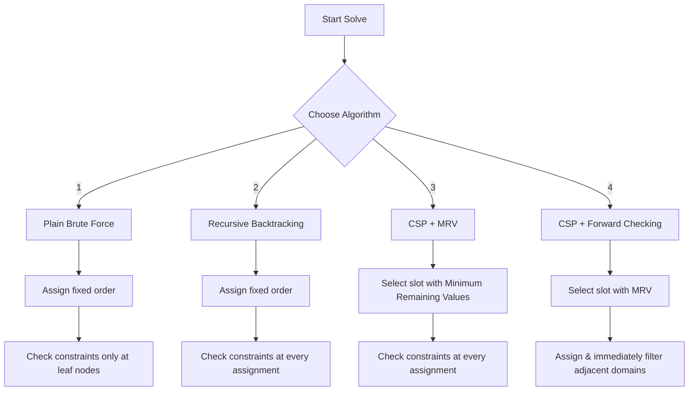

# Crossword Solver Backend — DAA Architecture & Algorithms

This directory contains the core Express API server and the **Design and Analysis of Algorithms (DAA)** engine that models and solves crossword puzzles. The solver treats crossword puzzles as a **Constraint Satisfaction Problem (CSP)** and implements four recursive search algorithms of increasing optimization.

---

## 📂 Backend Architecture

```text
backend/src/
├── server.ts                 # HTTP Server entry point (Port 5000)
├── app.ts                    # Express routing, payload parsing, and CORS setup
├── types/
│   └── puzzle.ts             # TypeScript definitions for slots, steps, stats, and puzzles
├── data/
│   └── puzzles.ts            # Handcrafted DAA-themed predefined puzzles library
└── algorithms/
    ├── grid.ts               # Cell coordinates, bounds, and character checking
    ├── slotDetection.ts      # Converts 2D grids into a list of word slots (Variables)
    ├── constraints.ts        # Maps and verifies intersecting slots (Overlap Constraints)
    ├── domains.ts            # Filters list of candidate words based on slot lengths
    ├── solver.ts             # The four recursive search solver engines
    └── generator.ts          # Seeded backtracking algorithm to build crossword grids
```

---

## 🧩 1. The Crossword as a CSP

In computer science, a **Constraint Satisfaction Problem (CSP)** is defined by a set of variables, their domains (allowable values), and constraints that must be satisfied. We model the crossword puzzle as follows:

1. **Variables ($X$)**: The word slots in the grid (e.g., Slot 1 Horizontal, Slot 2 Vertical). Let $n$ be the number of slots: $X = \{x_1, x_2, \dots, x_n\}$.
2. **Domains ($D$)**: For each slot $x_i$, the domain $D_i$ is the set of candidate words from the word bank that match the length of $x_i$. Let $m$ be the maximum size of any domain: $|D_i| \le m$.
3. **Constraints ($C$)**: Two slots $x_i$ and $x_j$ constrain each other if they overlap in the grid. The character at the intersection cell must be identical for both assigned words.
   $$\text{Constraint}(x_i, x_j) \implies \text{Word}_i[\text{intersection}_i] = \text{Word}_j[\text{intersection}_j]$$

---

## ⚙️ 2. Core Modules & Logic Flow

### A. Slot Detection (`slotDetection.ts`)
Before solving, the 2D grid of blank cells (`.`) and block cells (`#`) must be converted into a list of variables (slots).
* **Scanning**: It scans the grid row-by-row (for Horizontal slots) and column-by-column (for Vertical slots).
* **Length Filter**: Consecutive blank cells of length $\ge 2$ are grouped into a `Slot`.
* **Properties**: Each detected slot contains a unique ID, start coordinates `(r, c)`, direction (`HORIZONTAL` or `VERTICAL`), and `length`.

### B. Intersection Analysis (`constraints.ts`)
Once slots are detected, the constraint graph is constructed:
* **Overlaps**: It compares every Horizontal slot against every Vertical slot.
* **Calculation**: If their grid coordinates cross, an `Intersection` constraint is registered.
* **Details**: The constraint specifies the overlapping index relative to the start of the Horizontal word and the Vertical word.

### C. The Solver Engine (`solver.ts`)
The core solver runs four distinct algorithms. Each algorithm records step-by-step search traces (assignments, rejections, backtracks, and pruned domains) to feed the frontend playback visualizer.

---

## 📈 3. Deep Dive into the Four DAA Algorithms



### 1. Plain Brute Force
* **Strategy**: Generates all possible permutations of word assignments using a fixed ordering. It only validates the intersection constraints **after a word is assigned to every single slot** (at the leaf nodes of the recursion tree).
* **Complexity**:
  * **Time Complexity**: $\mathcal{O}(m^n)$ — must explore the entire search space of depth $n$ and branching factor $m$.
  * **Space Complexity**: $\mathcal{O}(n)$ — requires only the recursion call stack of depth $n$.
* **DAA Analysis**: Highly inefficient; does not leverage constraint propagation or early pruning.

### 2. Recursive Backtracking
* **Strategy**: Performs a Depth-First Search (DFS) on the assignment tree. It assigns words to slots in a fixed order, but checks constraints **immediately after each assignment**. If a conflict is detected at slot $i$, it immediately backtracks and tries the next candidate without exploring the subtree under slot $i$.
* **Complexity**:
  * **Time Complexity**: $\mathcal{O}(m^n)$ worst-case, but $\mathcal{O}(\text{typical}) \ll \mathcal{O}(m^n)$ due to early pruning of conflict subtrees.
  * **Space Complexity**: $\mathcal{O}(n)$ — recursion call stack of depth $n$.
* **DAA Analysis**: A classic example of backtracking pruning. It significantly reduces the empirical runtime by catching conflicts early.

### 3. CSP + Minimum Remaining Values (MRV)
* **Heuristics**:
  1. **MRV Heuristic**: Dynamically selects the next unassigned slot with the **fewest remaining valid words** in its domain. This isolates highly constrained variables first (fail-first principle).
  2. **Degree Heuristic**: Breaks ties by selecting the slot that shares the most intersections with other unassigned slots.
* **Complexity**:
  * **Time Complexity**: $\mathcal{O}(m^n)$ worst-case, but far faster in practice because it forces failures to happen high up in the search tree.
  * **Space Complexity**: $\mathcal{O}(n \cdot m)$ — requires maintaining domain lists of size $m$ for all $n$ slots. These lists are read-only at each recursion node.
* **DAA Analysis**: Combines backtracking with informed variable ordering to optimize search traversal.

### 4. CSP + Forward Checking
* **Strategy**: Implements **Constraint Propagation**. After assigning a word to a slot:
  1. It clones the domains of all adjacent (intersecting) unassigned slots.
  2. It prunes (removes) any words from those domains that do not match the character at the intersection cell.
  3. If any neighboring slot's domain becomes completely empty ($\emptyset$), the algorithm **immediately rejects the current assignment and backtracks**, avoiding the entire search branch before even entering it.
* **Complexity**:
  * **Time Complexity**: $\mathcal{O}(m^n)$ worst-case, but typically $\mathcal{O}(k^n)$ where $k \ll m$ is the pruned branching factor.
  * **Space Complexity**: $\mathcal{O}(n^2 \cdot m)$ — at each level of the recursion stack (up to depth $n$), it clones the full domain map of size $O(n \cdot m)$ to support backtracking rollback.
* **DAA Analysis**: Shows the classic time-space trade-off. It consumes more memory to store domain snapshots on the call stack, but yields the fastest empirical runtime by aggressively shrinking the branching factor.

---

## 📊 4. Theoretical Complexity Summary

| Algorithm | Variable Order | Constraint Check | Domain Propagation | Time (Worst) | Time (Typical) | Space |
| :--- | :--- | :--- | :--- | :--- | :--- | :--- |
| **Brute Force** | Fixed | Only at leaf nodes | None | $\mathcal{O}(m^n)$ | $\mathcal{O}(m^n)$ | $\mathcal{O}(n)$ |
| **Backtracking** | Fixed | Per assignment | None | $\mathcal{O}(m^n)$ | $< \mathcal{O}(m^n)$ | $\mathcal{O}(n)$ |
| **CSP + MRV** | Dynamic (MRV) | Per assignment | None | $\mathcal{O}(m^n)$ | $\ll \mathcal{O}(m^n)$ | $\mathcal{O}(n \cdot m)$ |
| **Forward Checking** | Dynamic (MRV) | Per assignment | Domain Cloned & Filtered | $\mathcal{O}(m^n)$ | $\mathcal{O}(k^n), k \ll m$ | $\mathcal{O}(n^2 \cdot m)$ |

---

## 🧪 5. Testing & Verification

Unit tests are written using **Vitest** to ensure correctness of slot detection and the search engines against various grid configurations.

To run the backend tests:
```bash
# Run from the /backend directory
npm install
npm run test
```
